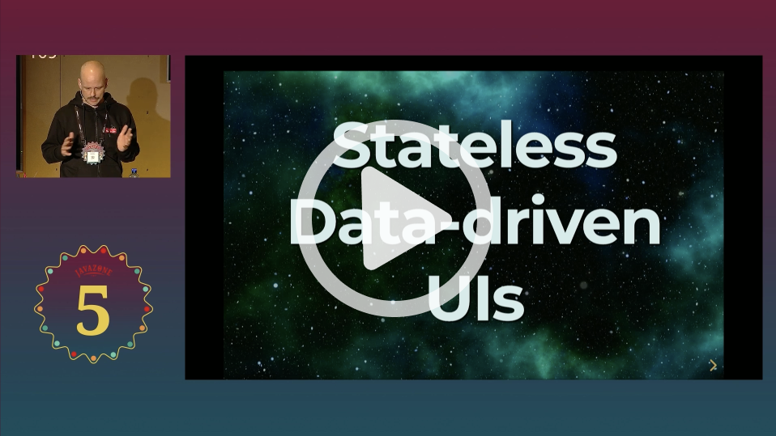

# The Replicant TodoMVC Example

An implementation of the [TodoMVC](http://todomvc.com) app using the [Replicant](https://github.com/cjohansen/replicant) library. You can try the app here:
* https://anteoas.github.io/replicant-todomvc/

***Replicant***: _A native [ClojureScript](https://clojurescript.org) virtual DOM renderer - render hiccup directly_

Replicant is a Clojure and ClojureScript library. Working with it has many similarities with React, but it is not using React and thus not depending on React and everything that React depends on. In fact Replicant has zero/zilch/no dependencies at all.

The example shows a way (of infinitely many) to wire up a Replicant app, with a focus on keeping the views as pure data. We can do this because replicant supports pure data DOM event handlers and VDOM lifecycle hooks.

To understand a bit of where Replicant comes from, please watch Christian Johansen's talk at JavaZone 2023, [Stateless, Data-driven UIs](https://2023.javazone.no/program/85f23370-440f-42b5-bf50-4cb811fef44d).

[](https://2023.javazone.no/program/85f23370-440f-42b5-bf50-4cb811fef44d)

## General implementation notes

As stated above, Replicant is a library. It is _not a framework_. It only concerns itself with rendering to the DOM (from its own variant of [Hiccup](https://github.com/weavejester/hiccup)), implementing a very efficient virtual DOM. While rendering, Replicant helps with dispatching DOM events and lifecycle hooks to the app. The app needs to implement an event handler. From there, Replicant has no further requirements. You can say that Replicant is satisfied with requiring you to work in functional and data-oriented way.

When dispatching events, Replicant allows to dispatch data instead of functions. It allows functions too, but we are using the data oriented approach in this app. This keeps our views not only pure functions, but also fully serializable. We arrange the data from the events in vectors of `actions`, where each `action` also is a vector, with the first element being the action name, and the rest is action arguments.

### The app state

The app state is a Clojure atom where the current state is stored as a map.

### App start

When the applications starts we initialize the app state, Replicant, and the router. The state is populated from local storage, or, lacking that, a default map. Both the router and Replicant are initialized with the event handler, meaning that both can dispatch events.

Next we register a watcher on the app state. This watcher will be called whenever the state changes. We use this to trigger a re-render of the app and also for persisting the state to local storage.

Last thing in the app start is to render the app with the initial state.

### The event handler

Replicant will provide our event handler with our event data (`actions`), plus some information about the event itself. We use this information to “enrich” the event data, so that our action handlers have information about things like the event source and the event target.

The event handler is just a simple dispatcher, dispatching on the action name. An action handler can update the app state, and perform any other side effects.

### Rendering

When all actions of an event are handled, we ask Replicant to render the app, providing the current state. If the state has not changed, Replicant will do no re-rendering.

### The actions

Actions can be big and monolithic or small and composable. It can be any mix in an application. In this example, we try to stay with the composable approach. Implementing some primitive actions, we can compose more complex event handlers.

### The views

The views are pure functions that return Hiccup (Clojure vectors representing the DOM). The functions have no local state (and don't use any globel state either), operating only on the data provided to them.

Replicant calls the top view with the app state, and that view then calls all the other views in a cascade. In development you can evaluate any subview in the REPL, while iterating on it, and examine what data (Hiccup) it returns. Since there is no local or global state, all you need to do is prvide enough data to the view. You can also write tests for the views. Hiccup is super easy to inspect.

### Routing

We use [Reitit](https://github.com/metosin/reitit) for routing. The route table is pure data, and the router dipatches `actions` (pure data, remember?) for our event handler.

### Side effects

Counting rendering as a side effect, the app is side-effecting as part of the application start, in the event handler, and from the app state atom watcher.

From a business rules perspective, the only side effects happen in the event handler.

### Read more about the general approach in the mini-app example

To understand a bit more about the code in this example, read the more comprehensive README of the [Replicant mini-app](https://github.com/anteoas/replicant-mini-app) example.

## Building the app

Prerequisites:

- [Node.js](https://nodejs.org) (or something node-ish enough)
- [Java](https://adoptopenjdk.net)
- [Clojure CLI](https://clojure.org/guides/getting_started)

### Release build

```sh
npm run build
```

### Running the app in development mode

We're using [shadow-cljs](https://github.com/thheller/shadow-cljs) to build the app. Clojure editors like [Calva](https://calva.io) and [CIDER](https://cider.mx/) will let you quickly start the app and connect you to its REPL. You can also just run it without installing anything, by using npx:

```sh
npx shadow-cljs watch :app
```

Once built, you can access the app at http://localhost:8585

To start the app with a Clojure editor friendly nREPL server, run:

```sh
npx shadow-cljs -d cider/cider-nrepl:0.50.2 watch :app
```

## Licence

Public Domain, **Unlicense**. See [LICENSE.md](LICENSE.md).

## Happy coding! ♥️

Please file issues if you have any questions or suggestions. Pull requests are also welcome (but please file an issue first if your PR would be beyond things like fixing typos). 🙏
